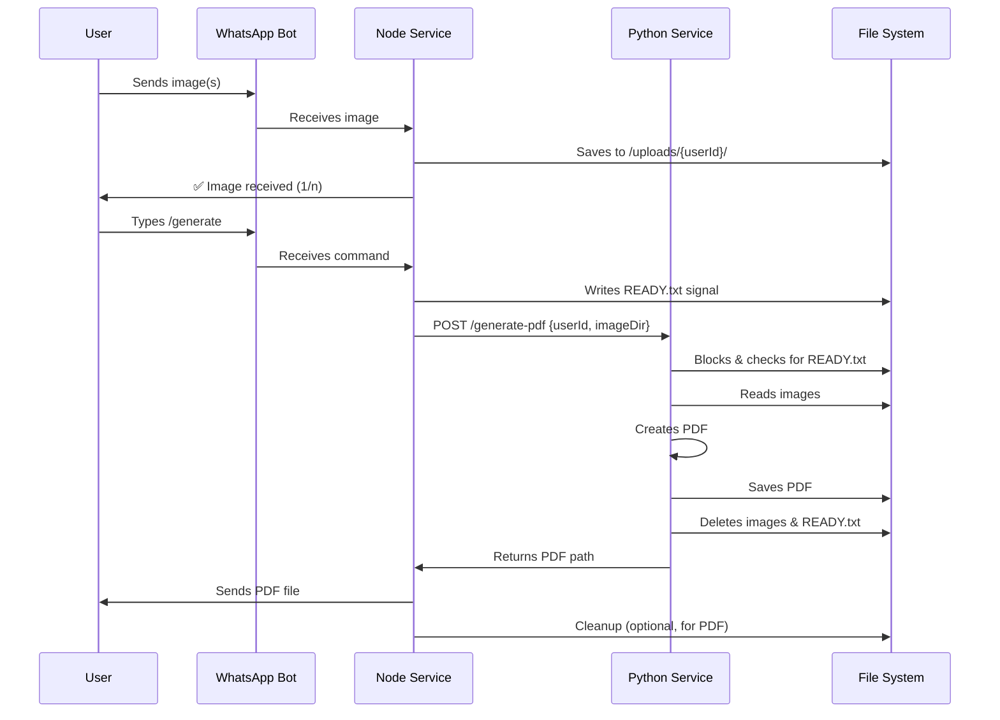

# WhatsApp PDF Bot - MVP Architecture Plan

## 🎯 MVP Scope

**Single Feature**: Convert WhatsApp images to PDF documents

**Core Flow**: User sends images → Bot collects them → User types `/generate` → Bot returns PDF

---

## 📦 Technology Stack

### Node.js Service (WhatsApp Client)

```json
{
  "whatsapp-web.js": "1.34.2",
  "qrcode-terminal": "0.12.0",
  "express": "5.2.1",
  "pino": "10.1.0",
  "axios": "1.13.2"
}
```

### Python Worker (PDF Generation)

```txt
Pillow==10.3.0
reportlab==4.1.0
fastapi==0.110.0
uvicorn==0.29.0
rembg==2.0.56
opencv-python==4.9.0.80
numpy==1.26.4
imutils==0.5.4
```

---

## 🏗️ Simplified Architecture

### Directory Structure

```
whatsapp-pdf-bot/
├── node-service/
│   ├── src/
│   │   ├── bot.js              # Main WhatsApp client
│   │   ├── handlers.js         # Message & command handling
│   │   ├── api-client.js       # Python service caller
│   │   └── logger.js           # Logging setup
│   ├── package.json
│   ├── Dockerfile
│   └── .env
│
├── python-service/
│   ├── main.py                 # FastAPI server
│   ├── pdf_generator.py        # Core PDF creation logic
│   ├── requirements.txt
│   └── Dockerfile
│
├── state/                      # Persistent state directory
│   └── user_sessions.json      # Session state file
│
├── shared/
│   └── uploads/                # Shared volume for images
│
├── docker-compose.yml
└── README.md
```

---

## 🔄 MVP Workflow



---

## 🐳 Docker Setup

### Service Architecture

```yaml
services:
  whatsapp-bot:
    - Runs Node.js + whatsapp-web.js
    - Mounts: ./shared/uploads (read/write)
    - Ports: 3000 (health check)

  pdf-worker:
    - Runs Python + FastAPI
    - Mounts: ./shared/uploads (read-only)
    - Ports: 8000 (internal API)
```

### Resource Allocation

- **Node Service**: 512MB RAM, 0.5 CPU
- **Python Service**: 1GB RAM, 1 CPU
- **Shared Volume**: 5GB limit

---

## 📋 Implementation Checklist

### Phase 1: Core Setup (Day 1-2)

- [✅] Initialize Node.js project with whatsapp-web.js
- [✅] Implement QR code authentication
- [✅] Create session persistence (local storage)
- [✅] Set up basic message receiving
- [✅] Implement `/start` and `/help` commands

### Phase 2: Image Handling (Day 3-4)

- [✅] Detect image messages (JPEG, PNG only)
- [✅] Save images to `shared/uploads/{userId}/`
- [✅] Track image count per user (in-memory Map)
- [✅] Send confirmation: "Image 1 received. Send more or type /start"
- [✅] Implement `/clear` command (delete user's images)

### Phase 3: PDF Service (Day 5-6)

Create FastAPI service with /generate-pdf endpoint

- [✅] Integrate smart image processing pipeline using rembg + opencv for background removalauto-cropping, and quality enhancement
- [✅] Implement image-to-PDF conversion using Pillow + ReportLab with processed images
- [✅] Add intelligent image sorting (by detected content, filename, timestamp)
- [✅] Generate PDF with metadata (date, page numbers, processing notes)
- [✅] Return optimized PDF with enhanced document quality

### Phase 4: Integration (Day 7-8)

- [✅] Node calls Python API via HTTP
- [✅] Handle PDF file sending via WhatsApp
- [✅] Implement cleanup (delete images after PDF sent)
- [✅] Add error handling (no images, API timeout)
- [✅] User feedback messages throughout process

### Phase 5: Docker & Deploy (Day 9-10)

- [✅] Create Dockerfiles for both services
- [✅] Write docker-compose.yml
- [ ] Test full flow in Docker environment
- [✅] Add health check endpoints
- [✅] Write deployment README

---

## 🔗 API Contract

### Python Service Endpoint

```http
POST /generate-pdf
Content-Type: application/json

{
  "userId": "+1234567890",
  "imageDir": "/uploads/+1234567890"
}

Response:
{
  "success": true,
  "pdfPath": "/uploads/+1234567890/output.pdf",
  "pageCount": 5,
  "fileSize": "2.3MB"
}
```

---

## 💾 Data Management

### Persistent State (Node Service)

The volatile in-memory Map is replaced with a disk-based persistence layer to ensure state recovery across service restarts.

- **Location**: `./state/user_sessions.json`
- **Structure**: A JSON object mapping `userId` to session data.

```json
{
  "+1234567890": {
    "images": ["img_001.jpg", "img_002.png"],
    "timestamp": "2025-12-17T21:30:00Z",
    "status": "collecting"
  }
}
```

- **Node.js Logic**:
  1. **Startup**: Load state from `./state/user_sessions.json` into an in-memory Map. If the file is missing or corrupt, initialize an empty Map.
  2. **Updates**: The state file is rewritten after every critical update (image received, session cleared, PDF generation initiated/completed).
  3. **Persistence**: Implement a debounced save function to prevent excessive disk I/O, ensuring the state is saved reliably.

### File System Structure

```
shared/uploads/
├── +1234567890/           # User's phone number as folder
│   ├── img_001.jpg
│   ├── img_002.png
│   └── output.pdf         # Generated PDF
├── +0987654321/
└── .gitkeep
```

### Cleanup Strategy

- Delete images immediately after PDF generation
- Keep PDF for 5 minutes (allow user to re-download)
- Auto-cleanup on `/clear` command or new session

---

## ⚠️ Error Handling

### WhatsApp Connection Errors

- Auto-reconnect with exponential backoff
- QR code refresh if session expires
- Graceful shutdown on persistent failure

### PDF Generation Errors

- Validate: At least 1 image exists
- Validate: Images are readable (not corrupted)
- Fallback: Return individual images as ZIP if PDF fails
- User message: "Failed to generate PDF. Try again or contact support."

### Rate Limiting

- Max 20 images per user per session
- Max PDF size: 25MB (WhatsApp limit)
- Command cooldown: 5 seconds between `/generate` calls

---

## 📊 MVP Success Metrics

### Technical Requirements

✅ WhatsApp stays connected for 24+ hours  
✅ PDF generation completes in <15 seconds (10 images)  
✅ Handles JPEG, PNG formats  
✅ Max 20 images per PDF  
✅ Auto-cleanup after delivery

### User Experience Requirements

✅ Clear confirmation messages for each image  
✅ Simple commands: `/start`, `/help`, `/generate`, `/clear`  
✅ Error messages are user-friendly  
✅ PDF includes page numbers and timestamp

---

## 🚀 Future Scaling Path (Post-MVP)

### Phase 2 Enhancements

1. **Redis for State**: Replace in-memory Map with Redis
2. **Queue System**: Add BullMQ for async job processing
3. **Multi-User**: Support multiple WhatsApp numbers
4. **Database**: Add PostgreSQL for user history

### Phase 3 Features

1. Add `/invoice` command (structured data collection)
2. Add `/cv` command (resume builder)
3. Template system for different document types
4. User preferences storage

---

## 🔧 Local Development vs Docker

### Local Development

```bash
# Terminal 1: Python service
cd python-service
pip install -r requirements.txt
uvicorn main:app --reload --port 8000

# Terminal 2: Node service
cd node-service
npm install
node src/bot.js
```

### Docker Production

```bash
docker-compose up -d
docker-compose logs -f whatsapp-bot
```

---

## 📝 Environment Variables

### Node Service (.env)

```env
PYTHON_API_URL=http://pdf-worker:8000
UPLOAD_DIR=/shared/uploads
MAX_IMAGES=20
SESSION_DIR=./sessions
LOG_LEVEL=info
```

### Python Service (.env)

```env
UPLOAD_DIR=/shared/uploads
MAX_PDF_SIZE_MB=25
ALLOWED_FORMATS=jpg,jpeg,png
LOG_LEVEL=info
```

---

## ✅ Definition of Done

The MVP is complete when:

1. ✅ User can scan QR and authenticate
2. ✅ User can send 1-20 images
3. ✅ Bot confirms each image received
4. ✅ User types `/generate` and receives PDF within 15 seconds
5. ✅ PDF contains all images in order with page numbers
6. ✅ System runs in Docker for 24+ hours without restart
7. ✅ Errors are handled gracefully with user feedback
8. ✅ README includes setup and usage instructions

---

## 🎓 Key Architectural Decisions

### Why This Architecture?

**Separation of Concerns**  
Node handles I/O-heavy WhatsApp communication  
Python handles CPU-heavy PDF generation

**Stateless Services**  
Easy to restart/scale  
No database complexity for MVP

**Shared Volume**  
Simple file passing between services  
No need for message queues yet

**HTTP API**  
Simple, debuggable  
Can add queue system later without code changes

**Docker Compose**  
One-command deployment  
Easy to add services later (Redis, PostgreSQL)

---

## 🚨 Critical Architectural Flaws & Resolutions

### 1. Shared Volume Synchronization (Race Condition)

**Flaw**: The Python service might attempt to read images before the Node.js service has fully completed writing them to the shared volume, leading to corrupted or missing files.

**Resolution: Ready Signal Mechanism**

| Service     | Action            | Logic                                                                                                                                                                                                                                          |
| :---------- | :---------------- | :--------------------------------------------------------------------------------------------------------------------------------------------------------------------------------------------------------------------------------------------- |
| **Node.js** | **Write Signal**  | After successfully saving the _final_ image file for a user session, write an empty file named `READY.txt` to `shared/uploads/{userId}/READY.txt`.                                                                                             |
| **Python**  | **Block & Check** | The `/generate-pdf` endpoint must strictly check for the existence of `READY.txt`. It will poll the file system every 500ms for up to 10 seconds. If `READY.txt` is found, processing begins. If the timeout is reached, an error is returned. |
| **Python**  | **Cleanup**       | After successful PDF generation, the Python service deletes the `READY.txt` file along with the images.                                                                                                                                        |

### 2. Volatile State Tracking (Crash Recovery)

**Flaw**: The in-memory `userSessions` Map is lost on Node.js service restart, leading to lost user progress and orphaned files in the shared volume.

**Resolution: Disk-Based Persistent State**

The state management is moved to a persistent file (`./state/user_sessions.json`) as detailed in the **Data Management** section.

| Service     | Role                 | Logic                                                                                                                                                                                                                                                                               |
| :---------- | :------------------- | :---------------------------------------------------------------------------------------------------------------------------------------------------------------------------------------------------------------------------------------------------------------------------------- |
| **Node.js** | **Source of Truth**  | Manages the state file, loading it on startup and saving it on every session change. This ensures crash recovery and reliable session data.                                                                                                                                         |
| **Python**  | **Reliable Cleanup** | The Node.js service will use the persistent state to determine which files to clean up _after_ the PDF is sent. The Python service's cleanup remains file-system based, but the persistent state ensures the Node.js service can reliably retry cleanup or track orphaned sessions. |

---

## 📚 Next Steps After MVP

1. **User Testing**: Share with 5-10 users, collect feedback
2. **Monitoring**: Add Prometheus + Grafana for metrics
3. **Scaling**: Move to Kubernetes if handling 100+ users
4. **Features**: Prioritize next feature based on user requests
5. **Database**: Add PostgreSQL when user history is needed

---

**Total MVP Timeline**: 10 days (single developer)  
**Deployment Target**: Docker Compose on VPS  
**Cost Estimate**: $10-20/month (VPS + domain)  
**Maintenance**: ~2 hours/week (monitoring, updates)
